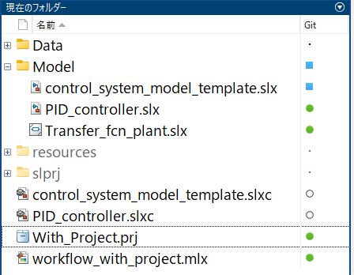
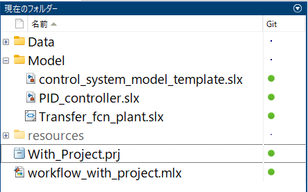
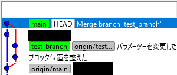

# Gitを使ってSimulinkのモデリングを進めるノウハウ
# 初期化

```matlab:Code
model_name = 'transfer_model';
```

# 「.slx」ファイルの圧縮設定を変更する


Simulinkモデルのデフォルト拡張子「.slx」は、ファイルサイズを小さくするために圧縮が行われています。しかし、圧縮をしたことにより、Gitが管理しているファイルの変更点箇所が増え、リポジトリのサイズが肥大化することがあります。


これを避けるために、圧縮しない設定をすることができます。モデルの「プロパティ インスペクター」を開き、「SLX圧縮」というプルダウンメニューで「なし」または「最速」を選択します。


他にも、Git管理を行うためのおすすめ設定があります。詳細については、「[Git ソース管理の設定](https://jp.mathworks.com/help/simulink/ug/set-up-git-source-control.html)」をご確認ください。


# 変更を取り消す


以下のコマンドを実行してモデルを開きます。


```matlab:Code
open_system(model_name);
```


このモデルに対して何らかの変更を加え、モデルを保存してください。


一般的に、モデルを作る作業は、変更して保存するサイクルを繰り返すことになります。しかし、「ここまで作った内容は間違いだったので、作業開始前の状態に戻したい」という場合があります。


ひとまず最新コミットの状態に戻したい場合は、モデルを右クリックして「ソース管理」「ローカルな変更を元に戻す」をクリックします。


また、それ以前のコミットの状態に戻したい場合は、モデルを右クリックして「ソース管理」「Gitを使用して元に戻す」をクリックします。


この時、現れたウィンドウで、元に戻したいコミット状態を選択し、「元に戻す」をクリックします。


モデルの状態が、その時のコミットの状態に戻ります。


# 一括して変更をリセットする


複数のファイルを使ってモデリングする場合、それらをまとめて元に戻したい時があります。プロジェクトを使っている場合は、以下のようにプロジェクトの「変更済み」をクリックし、変更されたファイルのみをリストアップします。


ここで、戻したいファイルを全て選択し、右クリックして「ソース管理」「ローカルな変更を元に戻す」または「Gitを使用して元に戻す」をクリックします。


これにより、変更が全てリセットされます。


# 戻す作業を効率化するスクリプト


もしプロジェクトを使っていない場合、もしくはプロジェクトを使っていても、上記の作業はマウス操作を伴うため、手間になります。また、上記作業ではGit管理されていないファイルを削除することができません。


特にSimulinkでは、「slprj」フォルダーや「.slxc」ファイルが生成されます。これらのファイルを削除したい場合は、個別に作業をしなければなりません。


そこで、戻す作業を効率化するスクリプト「g_RevertClean.m」を作成しました。


```matlab:Code
edit('g_RevertClean');
```


このスクリプトでは、Gitのコマンドを用いてファイルの状態を元に戻します。


「g_RevertClean.m」をMATLABのパスが通った場所に置き、コマンドウィンドウに「g_RevertClean」と入力し、実行すると、フォルダー内の変更済みファイルを最新コミット状態に戻し、Git管理されていないファイルを全て削除します。


【実行前】





【実行後】





もし、Git管理されていないファイルを削除したくない時は、以下のように「g_RevertClean」の後にスペースを入れ、「a」を入力します（実際には、「r」以外のどのような文字でもOKです）。


このように実行すると、Git管理されていないファイルは削除せず、変更されたファイルのみを元に戻します。


# コミットを取り消す


コミットを間違えてしまったので取り消したいと思った時は、もしプッシュする前であれば、一つの方法としてローカルリポジトリを丸ごとリセットしてリモートリポジトリに一致させるという方法があります。


以下のように「r」を引数に「g_RevertClean」を実行すると、ローカルリポジトリにコミットされた情報を全て取り消し、リモートリポジトリに一致させることができます。


コミットを戻す可能性がある時は、プッシュする頻度を落とした方が良いです。


# スクリプトの仕組み


「g_RevertClean.m」というスクリプトでは、「!（感嘆符）」が使われています。「!」は、コマンドをOSに渡して実行させることができます。つまり、MATLABスクリプトで書かれたgitコマンドがOSに送られ、OS側でgitアプリを呼び出して、そのコマンドを実行する、ということが行われています。


詳細については、「[外部コマンド、スクリプト、プログラムの実行](https://jp.mathworks.com/help/matlab/matlab_external/run-external-commands-scripts-and-programs.html)」をご参照ください。


# ブランチを作って作業する


最初に作った「main（master）」ブランチは、何か間違いがあった時に変更を取り消すことが難しい場合があります。そのような場合は、新しくブランチを作成して作業を行い、完了したらmainにマージする、というワークフローが推奨されます。


また、複数人で共同開発をしている時は、全員がmainで作業していると、コミットが競合してしまいます。それを回避するためにも、別々のブランチで作業することが推奨されます。


ブランチを作るには、現在のフォルダーを右クリックして「ソース管理」「ブランチ」をクリックします。


現れたウィンドウの「ブランチとタブの作成^」をクリックして隠れたメニューを展開し、名前欄に新しいブランチの名前を入力し、「作成」をクリックします。


以下のように、mainの隣に新しいブランチが現れます。


次に、ブランチブラウザーの「ブランチ：」を新しく作成したブランチ名に変更し、「切り替え」をクリックします。


注意メッセージが表示されますが、ここでは「はい」をクリックします。


これによりブランチが切り替わります。


以降のコミットは、その新しく作ったブランチに対して行われ、mainには影響を与えません。


プッシュを行った場合は、そのブランチがリモートリポジトリに送られ、管理されることになります。この時もmainには影響を与えません。


# ブランチをマージする


ブランチで作ったモデルをmainに反映させるには、マージを行います。現在のフォルダーを右クリックして「ソース管理」「ブランチ」をクリックします。


まず、上記のブランチを切り替える操作を行い、現在のブランチをmainに戻します。次にブランチブラウザーのブランチを新しく作ったブランチに設定し、「マージ」をクリックします。


そうすると、以下のようにブランチの変更がmainに反映されます。その間、main側で変更があった場合でも、同じファイルを変更していない限りは競合にはなりません。同じファイルをそれぞれのブランチで変更した場合は、競合を解決する作業が必要になります。





また、マージ作業をしただけではリモートリポジトリに反映されませんので、忘れずにプッシュをしましょう。


# 終了処理

```matlab:Code
cd(root_directory);
```

  


*Copyright 2022 The MathWorks, Inc.*


