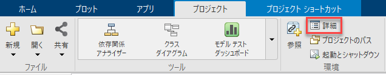

# プロジェクトを使って効率よく運用する
# 背景


複数のファイルを同時に使って開発を行う場合、プロジェクトを作成して開発を進めることを推奨します。


例えば、以下のように制御モデルとプラントモデルを組み合わせたシステムをシミュレーションする場合、モデルやデータ、パラメーターなどをファイルに分けて管理します。


本デモモデルは、以下のように5個のファイル構成されています。


# プロジェクトを作成


MATLABの「ホーム」タブから「プロジェクト」「フォルダーから」をクリックします。


現れたウィンドウでプロジェクト名を入力し、プロジェクトファイルを格納するフォルダーを選択します。入力したら「作成」をクリックします。


「resources」フォルダーが作成され、プロジェクトの設定ファイルがその中に格納されます。また、プロジェクトの起動ファイル（ここでは「With_Project.prj」）が作成されます。以降は、そのファイルをダブルクリックすることをでプロジェクトを起動できます。


ここでは、プロジェクト作成と同時にそのプロジェクトは起動され、以下のように表示されます。初回の立ち上げのため、「ようこそ」画面が出ていますが、ここでは「×」をクリックして閉じます。


プロジェクトを閉じる時は、以下の「×」をクリックします。


# プロジェクト内フォルダーを作る


多数のファイルを管理するには、分類ごとにファイルをフォルダーに分けることが重要です。ここで、プロジェクト内にフォルダーを作り、そこにファイルを加えていきます。


プロジェクトの空白部分で右クリックし、「新規」「フォルダー」をクリックします。


ここでは、例えば以下のように作ります。


作ったフォルダーは、薄い文字とアイコンで表示されています。この状態では、フォルダー内はパスが通っていません。そこで、フォルダーパスをプロジェクトに追加することで、その中のファイルを見つけられるようにします。


作ったフォルダーそれぞれに対して右クリックして「プロジェクトのパス」「プロジェクトのパスに追加」をクリックします。


パスが通ったことで、文字とアイコンが濃くなります。


ここで、5個のファイルをそれぞれフォルダーに分けます。以下のようにドラッグ\&ドロップすることで、フォルダー分けすることができます。


問題なく格納できれば、以下のようになります。


もし、更に新規にファイルを用意してプロジェクトに登録したい場合は、同じようにプロジェクトウィンドウ内のフォルダーにドラッグ\&ドロップすることで登録できます。


例えば、以下のように「new_model.slx」を作った時、Modelフォルダにドラッグ\&ドロップして登録できます。


# プロジェクトをコミットする


ここで、一連のプロジェクト設定ファイルとモデルファイルをGitで管理させます。「resources」フォルダー以下のファイルやプロジェクト起動ファイルは、作られた段階で「追加」された状態になっています（以下のように+のマークが付いています）。


「追加」が終わっているので、すぐに「コミット」を行うことができます。ここで、プロジェクトを作ったことにより、MATLABのツールストリップに「プロジェクト」というタブが現れています。


「プロジェクト」タブの「コミット」をクリックします。


以下のようにコメントを入力し、「送信」をクリックします。


これにより、以下のように全てのファイルが緑色の丸印になり、コミットが完了します。


# キャッシュファイルを格納するフォルダーを作成する


Simulinkモデルを実行すると、「slprj」フォルダーや「.slxc」ファイルが生成されます。これらはモデルの再ビルドを効率化するための一時ファイルであり、現在のフォルダーに無造作に生成されるのは、あまり好ましい状態ではありません。


プロジェクトを使うと、このキャッシュファイルが特定のフォルダーに生成されるように設定できます。


まず、プロジェクトで新しくフォルダーを作成し、プロジェクトパスに追加します。


次に、「プロジェクト」タブの「詳細」をクリックします。





プロジェクトの詳細の「生成されたSimulinkファイル」の「シミュレーション キャッシュ フォルダー」で「参照」をクリックし、その新しく作ったフォルダーを指定します。もしコード生成も行う場合は、「コード生成フォルダー」も合わせて設定しておくことをお勧めします。


指定したらOKをクリックします。


これにより、キャッシュファイルは設定したフォルダーに生成されるようになります。


プロジェクトの設定を変更した時、「resources」フォルダーの中のファイル構成が変更されます。従って、Gitコミットをして変更点を記録する必要があります。


# 終了処理

```matlab:Code
cd(root_directory);
```

  


*Copyright 2022 The MathWorks, Inc.*


