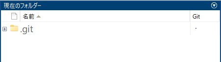

# リモートリポジトリを作成し、Git管理を始める
# 初期化

```matlab:Code
mkdir('local');
mkdir('remote');
```

# PC内にリモートリポジトリを作成する方法


現在のフォルダーで右クリックし、「ソース管理」「ファイルの管理...」をクリックします。


現れたウィンドウで、「変更」をクリックします。


現れたウィンドウで「+」をクリックします。


リモートリポジトリを作成するフォルダーを選択し、以下のようになったら「OK」をクリックします。


次に、サンドボックスにローカルリポジトリを作成するフォルダーパスを入力します。入力が終わったら「取得」をクリックします。


サンドボックスで指定したパス（ローカルリポジトリ）のフォルダーがGit管理された状態になります。





# ローカルリポジトリにモデルファイルを追加する


ローカルリポジトリのフォルダーに、Simulinkモデルを追加します。新規作成、もしくは、すでに作成されたモデルをコピーします。


この時、そのモデルファイルのGitという欄（Gitステータス）に、白丸が付いています。この状態は、そのファイルがGit管理されていない状態であることを示します。


# モデルファイルをコミットする


まず、モデルファイルを右クリックし、「ソース管理」「Gitに追加」をクリックします。


以下のように、Gitステータスが+マークになります。この状態はGitにトラッキングされた状態になります。


次に、モデルファイルを右クリックして「ソース管理」「変更の表示とコミット...」をクリックします。


以下のウィンドウが表示されます。「Comment」欄（以下の赤矢印の箇所）に、どのような変更を加えたかを説明するコメントを追加します。その後、「Commit」をクリックします。


以下のようにGitステータスが緑色の丸印になります。この状態は、モデルがコミットされていることを示します。


# 終了処理

```matlab:Code
cd(root_directory);
```

  


*Copyright 2022 The MathWorks, Inc.*


