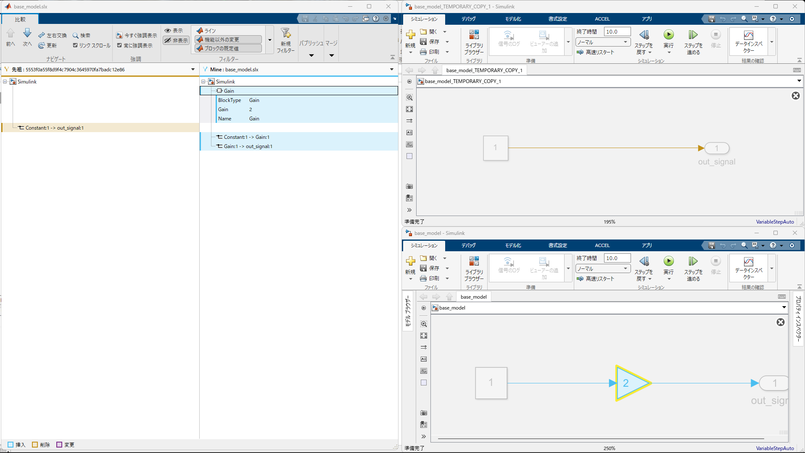
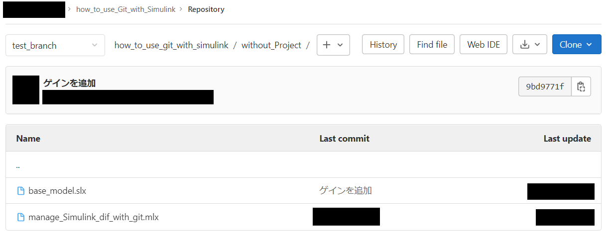

# Simulinkモデルの変更点をGitで管理
# 初期化

```matlab:Code
model_name = 'base_model';
```

# 最初のモデル


Simulinkモデルを開きます。


```matlab:Code
open_system(model_name);
```


モデルを編集する前に、現在のフォルダーを見てみましょう。


Gitという欄（Gitステータス）に、緑色の丸印が付いています。これは、SimulinkモデルがGitのローカルリポジトリの最新コミット状態と同一であることを示しています。


# モデルを修正する


ここで、Gainブロックを挿入し、以下のようにConstantブロックの値を2倍した値を出力するように変更します。


変更した後、モデルを保存します。現在のフォルダーを見てみると、青色の四角形マークになっています。これは、SimulinkモデルがGitのローカルリポジトリの最新コミット状態と異なる状態になっていることを示しています。


# 差分を確認する


この時、最新コミット状態と今ローカルに保存されたモデルの変化点を確認することができます。以下のように、モデルファイルを右クリックして「ソース管理」「先祖と比較」をクリックします。


クリックすると、比較機能が起動し、モデルの差分を以下のように表示します。左側のウィンドウでは、ブロック図の構造をツリー表示し、違いを分かりやすく分類しています。右上のモデルは変更前（最新コミット状態）、右下はローカルに保存した状態のモデルです。





ちなみに、「先祖」という言葉は、ここでは「最新コミット状態」と同じ意味であると考えてよいです。


# コミットする


変更点に問題が無ければ、コミットを行います。モデルファイルを右クリックして「ソース管理」「変更の表示とコミット...」をクリックします。


以下のウィンドウが表示されます。変更を行ったモデルファイルにチェックが入っていることを確認し、「Comment」欄（以下の赤矢印の箇所）に、どのような変更を加えたかを説明するコメントを追加します。その後、「Commit」をクリックします。


ちなみに、ここでモデルファイル以外にも変更をしたファイルがあった時、以下のようにリストに表示されます。それも一緒にコミットしたい場合は、そのファイルにもチェックを入れておきます。


コミットが完了すると、以下のようにモデルファイルのGitステータスが緑丸になります。


# コミット履歴を確認する


コミットを繰り返しながらモデルを作っていくと、過去のコミット履歴を確認したい時があります。この時、モデルファイルを右クリックして「ソース管理」「ブランチ」をクリックします。


以下のように、過去のコミットが新しい順に並べられ、それぞれのコミットに対して、コメントや作成者、いつコミットしたかの情報を見ることができます。


# プッシュする


コミットされた情報をリモートリポジトリに反映させるため、プッシュを行います。この時、リモートリポジトリがGitHubなどのホスティングサービスに置かれていれば、そのサイト側に更新情報が送られ、変更点を確認できるようになります。


モデルファイル、もしくは現在のフォルダーの空いている箇所を右クリックし、「ソース管理」「プッシュ」をクリックします。


問題なくプッシュができれば、MATLABの方では何も変化が起きません。リモートリポジトリを管理しているサイトの方を確認すると、先程のコミットが反映されていることがわかります。





# 終了処理

```matlab:Code
cd(root_directory);
```

  


*Copyright 2022 The MathWorks, Inc.*


