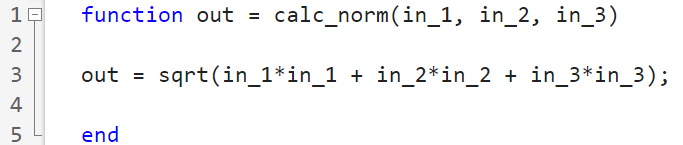
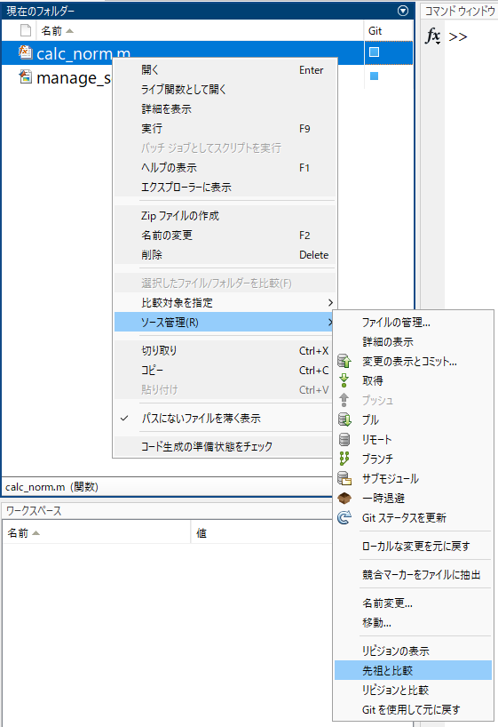
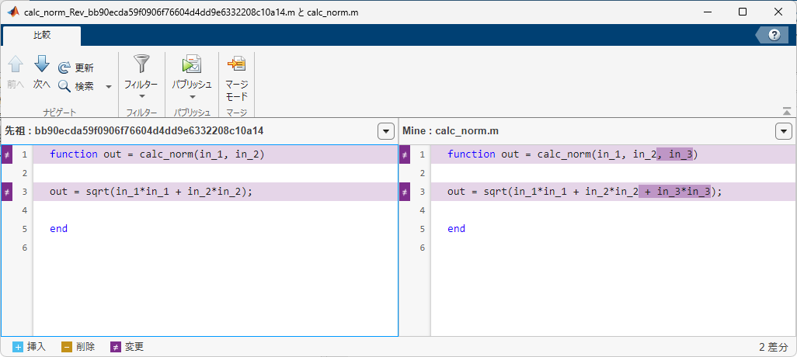

# スクリプトの変更点をGitで管理
# スクリプトファイルの差分


スクリプトファイル（.mファイル）はMATLABで差分を確認することができますが、テキストファイルであるため、外部のテキスト差分比較ツールなどでも変更点を確認できます。


「calc_norm.m」を開いて、以下のように変更します。





その後、ファイルを右クリックし、「ソース管理」「先祖と比較」をクリックします。





以下のように、差分がある箇所を確認することができます。





# ライブスクリプトファイルの差分


ライブスクリプトファイル（.mlxファイル）も同じように差分を確認できます。ライブスクリプトファイルはバイナリファイルであるため、外部の差分比較ツールなどでは差分を確認することはできません。


MATLABでは、スクリプトファイルと同じ操作でライブスクリプトファイルの差分を確認できます。


# 終了処理

```matlab:Code
cd(root_directory);
```

  


*Copyright 2022 The MathWorks, Inc.*


